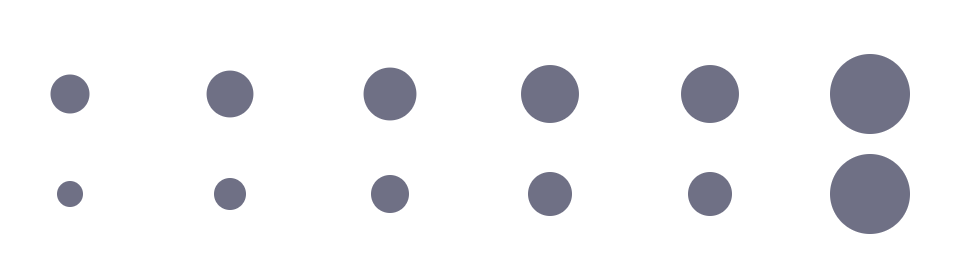

# Programació de visualitzacions per la web
  * [Introducció a D3](#introducci--a-d3)
  * [Data binding](#data-binding)
    + [Primer gràfic: Gràfic de barres horitzonals](#primer-gr-fic--gr-fic-de-barres-horitzonals)
  * [SVG](#svg)
  * [Càrrega i preparació de dades](#c-rrega-i-preparaci--de-dades)
  * [Exemples reals](#exemples-reals)
    + [Visualització de dades de sèries](#visualitzaci--de-dades-de-s-ries)
    + [Creative coding](#creative-coding)
  * [Webs de referència](#webs-de-refer-ncia)


## Prerequisitos

Para poder trabajar con D3, necesitaremos disponer de un servidor web local. Les siguientes webs explican como hacerlo: 
* https://developer.mozilla.org/en-US/docs/Learn/Common_questions/set_up_a_local_testing_server
* https://gist.github.com/jgravois/5e73b56fa7756fd00b89

## Introducción a D3

* Crear pàgina HTML en blanco
* Sublime Text: "html + TAB”
* Añadir charset al head
```<meta charset="utf-8">```

* Añadir al head el tag de D3
```
<script src="https://d3js.org/d3.v5.min.js"></script>
```

* Abrir Developer Tools y vaidar la versión de D3
```
d3.version
```

Añadiremos a nuestro código un estil de CSS
```
<style type="text/css">
	.blue {
		background-color: lightblue;
	}
</style>
```

* Crear un ```<p>```, y seleccionarlo des de la consola
```
d3.select("p")
```

* ```d3.select``` nos permite seleccionar un elemento. ```d3.selectAll``` selecciona __TODOS__ los elementos

* ```d3.select``` nos devuelve un array

* Repetir la sel·lecció y guardarla a una variable
```
var paragraph = d3.select("p")
```

* Canviar el style del párrafo
```
paragraph.style("background-color", "lightblue")
```

  * El código fuente no ha cambiado, pero el DOM si

* Con reload, volvemos a lo mismo que contiene el fichero HTML.
* Mostrar "method chaining"
```
var paragraph = d3.select("p")
paragraph.style("background-color", "lightblue").style("color", "green")
```

* Para que el "method chaining", cada método debe devolver un objeto. Debemos dominar qué hace cada método para ser conscientes de qué hacemos cuando encadenamos llamadas

* Crear un nuevo párrafo y asignarle un texto
```
d3.select("body")
	.append("p")
	.text("Hola bon dia, soy un párrafo")
```

* Crearemos una variable con el "body", y aquí iremos añadiendo nuevos elementos
```
var body = d3.select("body")
```

* Crear un h1
```
body.append("h1")
var h1 = body.select("h1").text("Títol!")
```
   * La función h1 nos devuelve una selección que contiene el elemento h1

* Diferencias entre .style y .attr

* Añadiremos la clase ```blue``` a nuestro h1 y veremos que se aplica el estilo que habíamos definido previamente
```
h1.attr("class", "blue")
```

## Data binding

* Asignaremos un array de datos a una selección mediante la función ```data```. Esto en D3 se le llama hacer _data binding_ 
```
var pes = body.selectAll("p")
	.data(["Hello", "Goodbye"])
```

* Si inspeccionamos el valor de ```pes``` en la consola, veremos que tienen un atributo ```__data__``` associado
* A nuestra selección le pondremos un valor entre los tags ```p``` con la función ```text()``` creando una función que es capaz de recuperar el dato asociado a la selección
```
pes.text(function(d) { return d;})
```

Des de la aparición de ES6, podemos utilizar 'arrow functions' que simplifican el código
```
pes.text(d => {return d;})
```

* ```d``` es la convención para referirnos a los datos asociados a cada elemento seleccionado

* Como ya disponíamos de dos ```<p>```, hemos cambiado su texto

* Podemos también acceder al índice de cada uno de nuestros elementos seleccionados. Generalmente se utiliza la convención ```i```

```
body.selectAll("p")
	.data(["Hello", "Goodbye"])
		.text((d, i) => {return 'Element: ' + i + ' Valor: ' + d;})
```

* Cambiaremos, de manera dinámica, el texto de cada párrafo

```
body.selectAll("p")
	.style("text-decoration", (d, i) => {
		return (i%2 == 0) ? 'overline' : 'line-through'
	})
	.text((d, i) => {return 'Element: ' + i + ' Valor: ' + d;})
```

* Pero, qué pasa si tenemos más datos que elementos existentes en mi DOM?

* Las funciones ```enter()``` y ```exit()``` no permiten decidir qué hacer en esos casos


* ```enter()``` nos devolverá un Array con tantas posiciones como elementos debemos añadir al DOM para cuadrar el número de elementos seleccionados con los datos

```
body.selectAll("p")
	.data(["Hello", "Goodbye", "Tercer element!"])
	.enter()
	.append("p")
		.text((d) => {return d;})

```

* Y si tenemos menos elementos?

```
body.selectAll("p")
	.data(["Only one element!"])
		.text((d, i) => {return d;})
```

* Con este código D3 ha cambiado solo el valor del primer elemento, pero seguimos teniendo 3 ```p``` en el DOM.

* Con la función ```exit()``` podremos marcarlos en rojo

```
body.selectAll("p")
	.data(["Només un element!"])
		.text((d, i) => {return d;})
	.exit()
		.style("color", "red")
```

* O podemos eliminarlos
```
body.selectAll("p")
	.data(["Només un element!"])
		.text((d, i) => {return d;})
	.exit()
		.remove()
```

* Update pattern: [Código demo 02_update_pattern.html](src/02_update_pattern.html)

* La función ```merge``` nos permitirá trabajar con los elementos visibles: enter + update. En este código añadiremos también una transición. [Código demo 03_update_pattern2.html](src/03_update_pattern2.html)

* Podemos ver también como, con el segundo parámetro de la función ```data```, podemos identificar los elementos que añadiremos al DOM de manera única para poder así reutilizarlos: [Código demo 04_update_pattern_keyjoin.html](04_update_pattern_keyjoin.html)

* Comentar demo de joins amb text
  + https://bl.ocks.org/mbostock/3808218
  + https://bl.ocks.org/mbostock/3808221
  + https://bl.ocks.org/mbostock/3808234

### Primer gràfic: Gràfic de barres horitzonals
* Partir del [template vacio](src/01_empty_template.html)
* Crear un ```div#viz``` donde podnremos nuestra visualización

```
var data = [100, 150, 250];

d3.select("#viz")
	.selectAll("div")
	.data(data)
	.enter()
	.append("div")
		.attr("class", "bar")
		.style("width", (d) => { return d + "px"; })
		.style("background-color", "steelblue")
		.style("min-height", "20px");		
```

* Le añadiremos texto a nuestras barras y veremos que podemos hacer una selección mediante la clase asignada a nuestros elementos utilizando un punto
```
d3.selectAll(".bar")
	.text((d) => { return d; })
```

* En este caso estamos utilizando los propios valores para definir su anchura, pero a menduo querremos definir el tamaño de nuestra visualización y que ésta se adapte en función de los valores
* Les [escalas](https://github.com/d3/d3-scale) nos ayudan a mapear valores entre un rango de valores en base al dominio de los mismo


```
var scale = d3.scaleLinear()
	.domain([0, d3.max(data)])
	.range([0, 400]);
```
* ```d3.max()``` es una de le múltiples [funciones](https://github.com/d3/d3-array) que D3 nos da para trabajar con nuestros datos

* Ahora podemos cambiar nuestro código de modo que el width de cara barra dependa de la escala. [Demo barchart](src/05_barchart.html)

* __Ejercicio__: Crea una visualización de un gráfico de barras donde, mediante la consola, puedas pasarle nuevos datos para que se actualice automáticamente
  * Nivel máster: utiliza transiciones para que las barras hagan una transición del valor actual al nuevo y que las que desaparezcan se "desvanezcan"

## SVG

* SVG es muy similar a HTML
* Ejemplo de código SVG: https://github.com/alignedleft/scattered-scatterplot/blob/master/03_svg.html
  * Todos los tags son autocontenidos excepto __text__


* Explorar y cambiar el código SVG
* Los elementos que forman parte de un SVG se ordenand en profundidad en función de su orden de aparición. SVG no tiene profundidad (z-index)
 * Podemos crear el mismo código SVG utilizando D3: https://github.com/alignedleft/scattered-scatterplot/blob/master/04_svg_with_d3.html

* Comentar la [demo de circulos en SVG](src/06_svg.html)

* __Ejercicio__: Crear dos lineas de círculos que se adapten en función de los valores pasados a la función ```update``` por consola. La primera linea debe mostrar el tamaño de los círculos utilizando la escala cuadrática, y la segundo la escala lineal (d3.scaleLinear) Crear dues "linies" de cercles que responguin a l'hora amb dades noves. Una linia de cercles ha de mostrar el radi amb l'escala ```d3.scaleSqrt``` i l'altra amb ```d3.scaleLinear```
  * Hint: Es aconsejable crear dos grupos (```g```) para separar las dos lineas de círuclos

 
``` 
var gSqrt = svg.append("g");
var gLinear = svg.append("g")
	.attr("transform", "translate(0,50)");
```

* [Creación de un scatter plot con ejes de coordenadas](src/07_scatter_plot.html)

* Ejemplo de un barchart vertical: https://bl.ocks.org/mbostock/3885304

## Carga y preparación de datos

* Los arrays de datos pueden ser más complejos que simples valores: https://github.com/alignedleft/scattered-scatterplot/blob/master/05_data_values.html


## Ejemplos reales

### Visualización de datos de series
* Demo: http://www.vpascual.org/onetandem/series/
* Códi: https://github.com/OneTandem/SeriesViz/blob/master/index.html

### Creative coding
* https://bl.ocks.org/vpascual/cdb2156b88539792d02cfaaab10efbaf

## Webs de referencia
* https://bl.ocks.org/
* https://bl.ocks.org/mbostock
* http://blockbuilder.org
* https://beta.observablehq.com/
* Curso curto y básico de D3: https://www.safaribooksonline.com/library/view/an-introduction-to/9781491906323/oreillyvideos2023599.html


